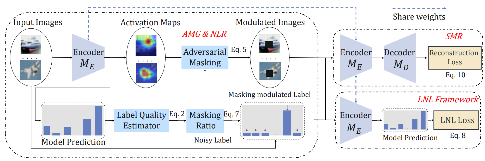
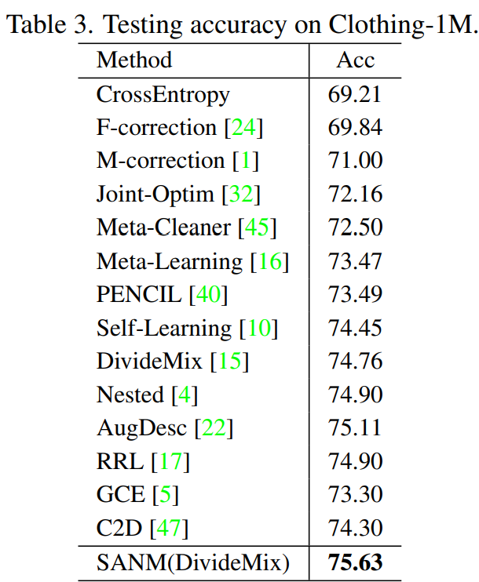

# SANM
Source code for our CVPR paper Learning with Noisy labels via Self-supervised Adversarial Noisy Masking

# Learning with Noisy labels via Self-supervised Adversarial Noisy Masking (CVPR 2023) 

This is the pytorch implementation of the [paper](https://openaccess.thecvf.com/content/CVPR2023/papers/Tu_Learning_With_Noisy_Labels_via_Self-Supervised_Adversarial_Noisy_Masking_CVPR_2023_paper.pdf) (accepted by CVPR 2023).



**Fig 1**.SANM framework

# Training
First, please create a folder named <i>checkpoint</i> to store the results.

```
mkdir checkpoint
```

Next, run 


```
python Train_{dataset_name}.py --data_path <i>path-to-your-data</i>
```


# Performance



# Videos
For the introduction of the paper, you can refer to [bilibili](https://www.bilibili.com/video/BV17w411r7SP/?spm_id_from=333.337.search-card.all.click) or [youtube](https://www.youtube.com/watch?v=Y-auFnnQ-lw&t=14s) for more details.

## Citation 
If you find SANM useful in your research, please consider citing.

```
@inproceedings{tu2023learning,
  title={Learning with Noisy labels via Self-supervised Adversarial Noisy Masking},
  author={Tu, Yuanpeng and Zhang, Boshen and Li, Yuxi and Liu, Liang and Li, Jian and Zhang, Jiangning and Wang, Yabiao and Wang, Chengjie and Zhao, Cai Rong},
  booktitle={Proceedings of the IEEE/CVF Conference on Computer Vision and Pattern Recognition},
  pages={16186--16195},
  year={2023}
}
```


## Reference
For C2D and DivideMix, you can refer to [C2D](https://github.com/ContrastToDivide/C2D) and [DivideMix](https://github.com/LiJunnan1992/DivideMix) and combine them with our SANM. Thanks for their great work!


